# UI/UX Design
---
### Потрібно завжди слідкувати за трендами:
1. Мінімалізм
2. Глазморфізм (елементи на склі)
3. 3D - елементи
4. Темний фон
5. Bauhaus (фокус на геометрію)
6. Анімовані ілюстрації (картинка рухається)
7. Великі шрифти
---
### 3 етапи на проекті для дизайнера:
~~~
- дрифування клієнта
- дослідження продукту
- ідея та структура сайту

!!! Завжди шукати сайти за схожою тематикою та досліджувати їх 

Бриф - це короткий список запитань до замовника з приводу того як має виглядати сайт
Мудборд - палітра кольорів, фотографії - для замовника
~~~
---
### Ресурси:
~~~
Telegram: UI/UX inspiration
Site: dribbble
~~~
---
### Тули:
~~~
- почта Gmail
- Google Drive
- Figma (десктоп)
- After Effects CC (Creative Cloud Version) - платна
- Media Encoder (Creative Cloud Version) - платна
(дві останні використовувати версії одного року випуску)
- Photoshop (або Paint.net) - перша програмка платна
- Cinema 4D R19 і вище
~~~
---
## Блоки курсу:
#### 1. UI: візуальна мова
#### 2. UX: проектування
#### 3. Мобільні інтерфейси
#### 4. Анімація інтерфейсів
#### 5. Основи 3D для веб-дизайну
---
### 1. Figma с нуля | UX UI Дизайнер: «Возрождение» | Бесплатный курс веб-дизайна — первый урок

### Розклад відео уроку:
0:00 - Інтро
5:02 - Фігма: з чого почиати
12:24 - Важливі концепції (Frame, Component, instance)
34:30 - Для чого використовувати фрейми
42:48 - Інтерфейс Figma
58:40 - Базові інструменти Фігми
01:10:58 - Примітиви в Фігмі
01:11:56 - Перо в Фігмі
01:12:15 - Текст в Фігмі
01:17:00 - Комментарі в Фігмі
01:19:56 - Робота з текстом та підключення шрифтів
01:30:50 - Заливка фігур/слоїв кольором та зображеннями
01:48:00 - Робота з лінією
01:53:55 - Полігон в Фігмі
01:56:00 - Работа с пером
02:02:30 - Маски и булеві функції
02:13:00 - Направляючі та сітки
02:18:55 - Стилі в Фігмі
02:27:50 - Завдання та відповіді на запитання
02:54:00 - Гарячі клавіші

---
### Теорія: визначення понять, гарячі кнопки, розділи, деякі елементи (посилання на макет з інформацією)
https://www.figma.com/file/XdapPvY1NPgzof0mED2ko7rh/%D0%9E%D1%81%D0%BD%D0%BE%D0%B2%D1%8B_figma?type=design&node-id=929-0&mode=design&t=UxGGR2wlvrTs8F2f-0

---

### Урок № 1 (записи):
__Фрейм__ (іконка в README.md) - це обєкт - контейнер в середині якого можна розміщувати багато елементів. Це фактично полотно, і у нього є свої налаштування.
__Компонент__ (іконка в README.md) - це елемент на основі якого можна створювати багато інстанцій (точних копій компонента), маючи можливість їх всіх редагувати, вносячи зміни тільки в основний компонент.
__Інстанція__ (іконка в README.md) - копія компонента, яка приймає всі основні його зміни (колір, шрифт, форму, розмір, і так далі ...)
Бекграунд малювати не фреймом а шейпом (shape).
Кнопки малювати фреймом.
В атрибутах "fill" -> це заливка кольором.
Всі компоненти потрібно дублювати, їх виносимо на зовні фрейму, як примірник готового елементу, який можна буде дублювати, а інстанція має залишатися у фреймі сторіночки.
Тільки фрейми можна прилінковувати, як окремі сторінки.
__"space (зажатий)"__ -> натискаємо і тримаємо пробіл і мишкою рухаємося по макету
Завжди робити щоб усі цифрові значення були цілими: __33рх, 115рх__, без використання дробових значень, таких як: __115, 367889рх__.
Фігма автоматично зберігає проект після кожної внесеної зміни.
Правильно при виборі роботи __з текстом__ зразу вибирати рамки контейнера, а вже потім вносити у нього сам текст.
Для точного виміру відступу між двома блоками тексту зажимати __"Alt"__ і стрілочками "вверх" та "вниз" створювати відступ.
При затисканні __"Shift"__ і клацанні стрілочками у різні сторони, блок переноситься одразу на 10 пікселів в різні сторони.

---

### В даному розділі детально описано значення усіх значків панелей управління Фігми:

---
#### Панель шарів (слоїв)

 - значок фрейму

 - значок компоненту

 - значок інстанції

 - значок шейпу (shape)

 - елемент кругу із зображенням

 - створена група маски

 - один із варіантів створеної булеан групи

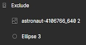 - один із варіантів створеної булеан групи

 - розлочений елемент (обєкт), доступний для редагування

 - залочений елемент (обєкт), не доступний для редагування

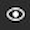 - обєкт видимий

 - обєкт не видимий (прихований)

---
### Верхнє меню управління
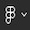 - основне меню Фігми із загальними налаштуваннями

 - меню з можливістю перенесення (перетягування) обєктів та зміни масштабування із збереженням пропорцій 

 - перетягування обєктів

 -  зміна масштабування із збереженням пропорцій обєкта

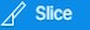 - для вибору зони, для прикладу для її експорту

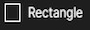 - вставляємо прямокутник (квадрат)

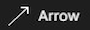 - вставляємо стрілку

- вставляємо круг

 - вставляємо звичайну лінію

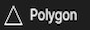 - вставляємо трикутник

 - вставляємо зірочку

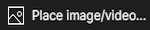 - вставляємо фото (робота із додаванням відео файлів вимагає платної версії редактора)

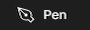 - нанесення векторних ліній 

 - довільне нанесення ліній із автоматичним їхнім згладжуванням

 - розділ типографіки, вводимо текст

!!! 7 Флоу створення свого стилю тексту: - натискаємо на , ствавимо курсор у потрібному місці, - в розділі зправа "Text" визначаємо необхідні налаштування, - натискаємо на 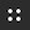, - потім на "+", заповнюємо "name" та "description", - натискаємо на "Create style".

!!! 8  -> можливість редагування стилю тексту з бібліотеки.

 - компоненти, плагіни та віджети

 - перетягування елементів

 - введення коментарів

---
### Права панель атрибутів
 - вісь "х" (ширина/горизонталь)

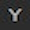 вісь "у" (висота/вертикаль)

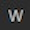 - width (розмір обєкта за шириною)

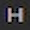 - height (розмір обєкта за висотою)

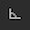 - rotate (зміщення обєкту в градусах)

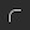 - border-radius (зміна кутів границі)

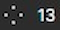 - виключно для форми трикутника (можна задати будь - яку кількість кутів і створити будь - яку форму)

 - виключно для зірочки - кількість кутів

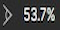 - рівень наповненості форми

 - незалежний бордер - радіус для кожної сторони бордеру

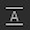 - пробіли між рядками

 - пробіли між буквами

 - пробіли між параграфами

 - встановлює автоматичну ширину

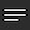 - автоматична висота

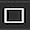 - фіксована величина (розмір)

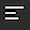 - вирівнювання тексту по горизонталі по лівому краю

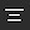 - вирівнювання тексту по горизонталі по середині

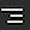 - вирівнювання тексту по горизонталі по правому краю

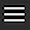 - вирівнювання тексту по горизонталі по обох краях

 - вирівнювання по вертикалі по відношенню до блоку зверху

 - вирівнювання по вертикалі по відношенню до блоку по середині

 - вирівнювання по вертикалі по відношенню до блоку знизу

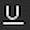 - підкреслення тексту

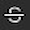 - перекреслення тексту

 - текст звичайного регістру

 - текст високого регістру

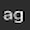 - текст низького регістру

 - не номерований список

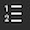 - номерований список

---
### Колір
 - розділ налаштування кольору

 - зображення заповнюється на весь контейнер

 - зображення встановлюється повністю

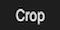 - режим редагування зображення

 - зображення дублюється (повторюється по всьому контейнері)

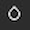 - режим змішування

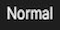 - звичайний режим

 - видно тільки контури

 - нічний режим

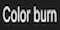 - дуже темний режим

 - режим схожий на normal (практично без різниці)

 - режим відбілювання

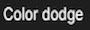 - режим світанку

 - темний режим глянцу

 - слабке освітлення

 - сильне освітлення

 - насиченість кольорів (глянцу)

 - природний колір, схожий на screen

 - обєкт не відображається взагалі

 - обєкт не відображається взагалі

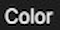 - ефект туші, без чітких ознак деталей обєкту

 - чітко чорно - білий обєкт

!!!!!! 7777 Опис даних режимів не точний, застосовувати із попереднім переглядом для кожного обєкта індивідуально  

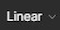 - лінійний градієнт 

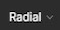 - радіальний градієнт

 - ангулярний градієнт

 - градієнт у вигляді ромбу (діаманту)

 - контакт (світло/темно)

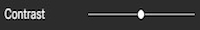 - контраст

 - додає та забирає кольори

 - додає холодні та теплі кольори

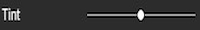 - розовий/зелений відтінки

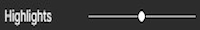 - зменшує та збільшує відблиск

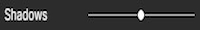 - регулювання тіні

!!! 3 Флоу створення нового стилю кольору, або градієнту: заходимо в "fill", натисаємо на , потім "+", вибираємо колір або градієнт і натискаємо на "Create style".

!!! 4 Так само, після цього, щоб застосовувати стиль кольору -> вибираємо обєкт, потім "fill", натисаємо на , і вибираємо стиль.

!!! 5  -> можливість редагування стилю кольору з бібліотеки.

---
### Тіні
 - розділ налаштування тіней

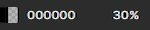 - налаштування тіней

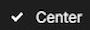 - тінь по центру

 - тінь в середині

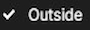 - тінь на зовні

 - рівень розмитості тіней

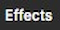 - додаткові налаштування тіней

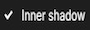 - внутрішня тінб

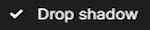 -???

 - додає розмитості основному тексту

 - додає розмитості задньому фону

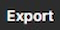 - експотувати фрагмент у різних розширеннях файлу

---
### Бордер - границя (до розділу - srtoke)

 - бордер зі всіх сторін 

 - бордер тільки зверху

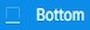 - бордер тільки знизу

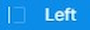 - бордер тільки зліва

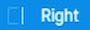 - бордер тільки зправа

.jpg) - міксований режим із заданими різними властивостями для різних сторін бордерів

 - суцільний бордер

 - пунктирний бордер

!!! 777 Для пунктирного бордера можна задавати значення ширини та пробілу між елементами (width, gap)

 - пунктирний бордер без додаткової стилізації

 - пунктирний бордер з квадратними краями

 - пунктирний бордер з заокругленими краями

---

### Налаштування лінії
 - лінія без додаткової стилізації

 - стрілочка на початку та/або в кінці лінії

 - трикутник на початку та/або в кінці лінії

 - зворотній трикутник на початку та/або в кінці лінії

 - кружечок на початку та/або в кінці лінії

 - ромбик на початку та/або в кінці лінії

 - заокруглена форма на початку та/або в кінці лінії

 - квадратна форма на початку та/або в кінці лінії

!!! 1 Стилі застосовуються як для лівої, так і для правої сторони лінії.

---
### Верхній розділ по середині - управління редактором
 - редагування обєкту

 - створення з обєкту компоненту

 - для вирізання частини фото під певною формою

!!! 777 Флоу обрізання маски: - вставляємо фото, - вибираємо форму (круг, зірочку, або будь - яку іншу), - наводимо форму на частину фото, яку хочемо обрізати під форму, - в панелі шарів, фото переносимо поверх форми, - тримаючи "Shift", виділяємо на панелі шарів фото і форму, - натискаємо зверху екрану на "mask", - зявляється частинка фото у формі.

 - меню редагування зображення в контейнері

 - булеан груп, схоже на mask. однак має більше функцій

 - зливає два обєкта в одне ціле та робить одного кольору, обєкти можна по різному розміщати поруч один із іншим

 - поєднує два обєкти створюючи один із них прозорої форми

 - вирізання частинки зображення в межах обраної форми, тобто вилучення частинки з основного фото

 - навпаки від попереднььої функції, під вибрану форму просто видаляє частинку з основного зображення

 - створює векторний елемент (до кінця не відома суть даної функції)

!!! 2 Якщо якісь обєкти поза межами фрейму не видно, натискаємо зверху над фреймом на його назву і зправа ставимо галочку на ___"Clip content"___.

!!! 3 Затискаючи "Alt" і наводячи на пустий простір між обєктами можна побачити відстань в пікселях між обєктами з будь - якої із сторін.

---
### Grid (сітка)
 - це фактично поділ фрейму на рядки та колонки.

 - для налаштування сітки.

 - створює колонки.

 - створює рядки.

#### для колонок:
 - колонки зліва.

 - колонки зправа.

 - колонки у центрі.

 - автоматично розтягнуті колонки із рівною автоматичною шириною по всьому вюпорту фрейму.
#### для рядків:
 - рядки зверху.

 - рядки знизу.

 - рядки по центру.

 - автоматично розтягнуті рядки із рівною автоматичною висотою по всьому вюпорту фрейму.

#### налаштування як для колонок, так і для рядків:
 - кількість рядків, або колонок у фреймі.

 - для рядків та колонок в режимі stretch, відступи на початку і в кінці рядків та колонок.

 - відступ між рядками, або колонками.

---
### створення та редагування створених стилів
 - створення стилів
 - редагування створених стилів

---
### Висновки:
1. Фігма, ліва панель - __панель шарів (слоїв)__.
2. Фігма, права панель - __панель атрибутів__.
3. Зверху зліва - __панель інструментів__.
4. Не усі __шрифти__ підтримують кирилицю, деякі з них застосовуються тільки до латиниці.
5. __mp4__ - формат в десять разів менше займає місця та не втрачає своєї якості.
6. Всі __текстові блоки одного характеру__, наприклад із заголовками __"h2"__ мають бути одного стилю (одинаковий шрифт, стиль тексту, відступи між рядками і параграфами, між словами відстань -> все має бути обовязково одинакове).
7. На сторінці не має бути заголовків __"h5"__, максимум потрібно використовувати до __"h4"__.

---

### Гарячі клавіші:
1. __"Delete"__ - видалити фрейм, елемент чи інстанцію.
2. __"Ctrl+Z"__ - повернути видалений елемент.
3. __"Ctrl+D"__ - дублювати елемент (спочатку клацаємо на елемент, тоді застосовуємо комбінацію клавіш і переносимо елемент).
4. __"Shift+click element"__ - для одночасної заміни якихось значень одразу декільком елементам - нажимаємо "Shift"  і клацаємо на всі елементи де потрібно внести зміни -> після чого їх вносимо.
5. __"Ctrl+Alt+K"__ - змінює фрейм на компонент, або інстанс (фрейм виділяється синім кольором, а компонент та інстанс - фіолетовим кольором).
6. __"Ctrl+["__ - переносимо обраний елемент в панелі шарів на один рівень вниз.
7. __"Ctrl+]"__ - переносимо обраний елемент в панелі шарів на один рівень вверх.
8. __"Ctrl+Shift+["__ - переносимо обраний елемент в самий низ структури фрейму.
9. __"Ctrl+Shift+]"__ - переносимо обраний елемент в самий верх структури фрейму.
10. Затискаючи __"Alt"__ і наводячи на пустий простір між обєктами можна побачити відстань в пікселях між обєктами з будь - якої із сторін.
11. Для точного виміру відступу між двома блоками тексту зажимати __"Alt"__ і стрілочками "вверх" та "вниз" створювати відступ.
12. При затисканні __"Shift"__ і клацанні стрілочками у різні сторони, блок переноситься одразу на 10 пікселів в різні сторони.
13. __"Shift+R"__ -> включити лінійку для Фігми. Після цього перетягувати направляючі лінії по вертикалі і горизонталі створюючи кордони для контенту, які не можна переходити.
